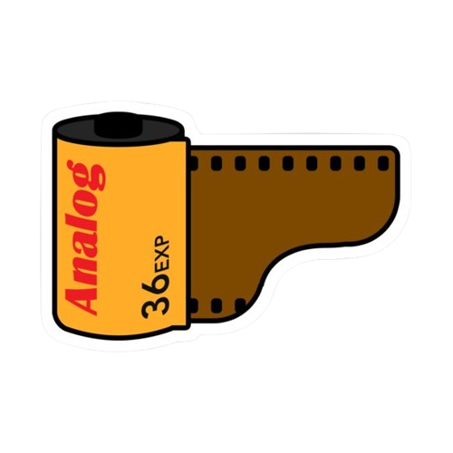

# 35mm Film Photo Gallery

This Django project is designed as a digital platform to host all of my 35mm film photographs. It's a simple, user-friendly way to manage and showcase my film photography collection online.

## Features

The project includes two types of user accounts with different levels of access:

1. **Admin Account**:
   - Upload and delete photos.
   - Download photos.
   - Manage the gallery and user access.

2. **Viewer Account**:
   - View the photo gallery.
   - Download photos.